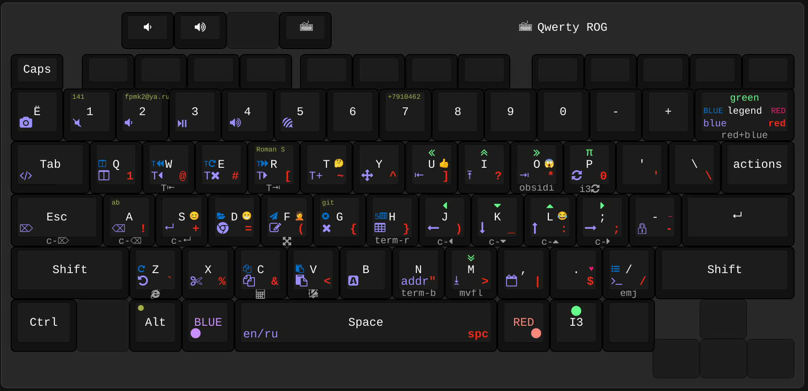

## This repository is outdated.
## My current layout: [https://github.com/Roman-/redblue](https://github.com/Roman-/redblue)
## Video: https://youtu.be/92pRAQeRIak

# Rog-redblue semiergonomic QWERTY layout

Semiergonomic because when your keyboard is embedded in a rectangle, the word "ergonomics" can't be used without irony.

## Hardware

Asus Rog Zephyrus G14 laptop.

## Environment
I am a C++ programmer speaking English and Russian. My OS is Ubuntu (i3wm) and I use VIM extensively.

## Key points in layout design
- QWERTY/ЙЦУКЕН layout preserved, except for some symbols (e.g. hyphen is now closer to right pinky);
- BLUE and RED add two (actually six) extra layers and are intended to be held with thumbs, which is even more ergonomic than reaching for Shifts with your pinkies;
- BLUE for navigation/actions, RED for symbols, Shift+RED for emoji, and BLUE+RED usually act like BLUE+Ctrl, e.g. while BLUE+a is backspace, BLUE+RED+a redirects to Ctrl+backspace (delete the word prior to cursor);
- CapsLock is swapped with Escape ([here is why](https://vim.fandom.com/wiki/Avoid_the_escape_key));
- Symbols are arranged based on their frequency in C++ and Bash programming languages. Mnemonics isn't taken into account, only the convenience/frequency;
- Return (aka Enter) and Backspace may now be pressed without any finger movements (`BLUE+s` and `BLUE+a`) even when your right hand is holding the mouse;
- No need to reach for Ctrl anymore. BLUE+c will redirect to Ctrl+c, BLUE+b to Ctrl+a etc.
- BLUE+jkl; for vim-like navigation are easy to use with left Shift; RED+BLUE+`jkl;` allows to jump between words because it redirects to Ctrl+arrows;
- BLUE+u/BLUE+o is for begin/end and they work with Shift (see xkb configs). E.g. BLUE+Shift+u will select to line begin
- Backspace/Delete are moved to places where they could be used with your left hand only, possibly with Ctrl modifier (e.g. `Ctrl+BLUE+F` to delete the whole word). Handy in GUI applications (e.g. web browser) where you're forced to use a mouse with your right hand;
- Instead of pressing `Alt+Tab` an unpredictable amount of times to switch between windows, you use `BLUE+key` to jump directly to the desired window (Chrome, Terminal, IDE, Telegram etc) in your favorite tiling wm. E.g. `BLUE+D` will set the focus on the Browser, or launch it if it's not yet opened.
- Navigation between tabs in any browser/filemanager/IDE with your left hand: Blue+w / Blue+r redirect to Ctrl+PageUp/PageDown, which is the consistent method of switching tabs. Blue+E for closing current tab (= Ctrl+w), Blue+T to open new tab (Ctrl+t); BLUE+RED+w/r to jump to first/last tab; Blue+Shift+E to restore closed tab.
- 0 and 1 are the most used number symbols in programming. They're copied to the RED layer to be conveniently typed in expressions like `if (i != 0) {`. Notice that your thumb is holding the RED key during the entire ` != 0) {` part, and you never have to reach the number row!
- emoji is mnemonic-based: T for `thinking`, S for `smiling`, L for `laughing`, F for `facepalm`, U for `thumbs Up`
