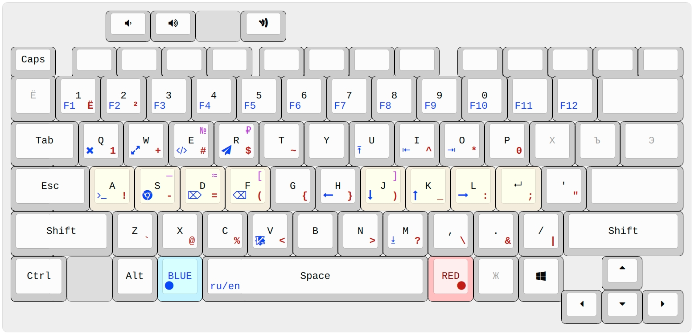

# Rog-redblue semiergonomic layout

Semiergonomic because when your keyboard is embedded in a rectangle, the word "ergonomics" can't be used without irony.

## Hardware

Asus Rog Zephyrus G14 laptop.

## Environment
I am a C++ programmer speaking English and Russian. My OS is Ubuntu and I use VIM extensively.

## Key points in layout design
- QWERTY/ЙЦУКЕН layout preserved;
- BLUE and RED add two (actually six) extra layers and are intended to be held with thumbs (which is even more ergonomic than reaching for Shifts with your pinkies)
- BLUE for navigation/launchers, RED for symbols. BLUE+RED for extra symbols (like № or ₽);
- Keys legend: center = no modifiers, bottom-left = `BLUE+key`, bottom-right = `RED+key`, top-right = `BLUE+RED+key`
- CapsLock is swapped with Escape ([here is why](https://vim.fandom.com/wiki/Avoid_the_escape_key));
- Symbols are arranged based on their frequency in C++ and Bash programming languages. Mnemonics isn't taken into account, only the convenience/frequency
- Return (aka Enter) button may now be pressed without any finger movement (`blue+;`)
- BLUE+hjkl for vim-like navigation are easy to use with left Shift and/or left Contorl (e.g. `Ctrl+BLUE+L` will move the cursor one word forward). `BLUE+i` = Home, `BLUE+o` = End.
- Backspace/Delete are moved to places where they could be used with your left hand only, possibly with Ctrl modifier (e.g. `Ctrl+BLUE+F` to delete the whole word). Handy in GUI applications (e.g. web browser) where you're forced to use a mouse with your right hand;
- Instead of pressing `Alt+Tab` an unpredictable amount of times to switch between windows, you use the `BLUE+key` to jump directly to the desired window (Chrome, Terminal, IDE, Telegram etc). E.g. `BLUE+S` will set the focus on the Browser, or launch it if it's not yet opened. Conventional `Alt+tab` is replaced with `BLUE+Q`. For other programs, the Alt key is still here;
- 0 and 1 are the most used number symbols in programming. They're copied to the RED layer to be conveniently typed in expressions like `if (i != 0) {`. Notice that your thumb is holding the RED key during the entire ` != 0) {` part, and you never have to reach the digit row!
