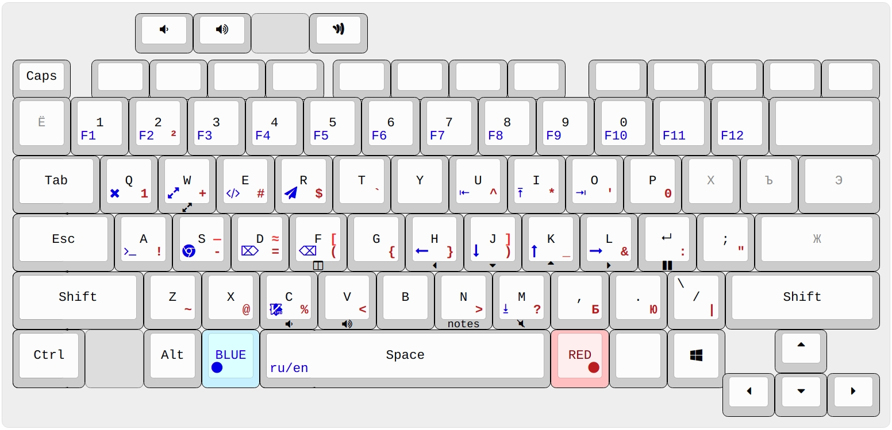

# Rog-redblue semiergonomic layout

Semiergonomic because when your keyboard is embedded in a rectangle, the word "ergonomics" can't be used without irony.

## Hardware

Asus Rog Zephyrus G14 laptop.

## Environment
I am a C++ programmer speaking English and Russian. My OS is Ubuntu and I use VIM extensively.

## Key points in layout design
- BLUE and RED add two (actually six) extra layers and are intended to be held with thumbs (which is even more ergonomic than reaching for Shifts with your pinies)
- BLUE for navigation/launchers, RED for symbols. BLUE+RED for misc functions like Media control or Tmux navigation.
- QWERTY/ЙЦУКЕН layout preserved;
- CapsLock is swapped with Escape ([here is why](https://vim.fandom.com/wiki/Avoid_the_escape_key))
- Keys legend: center = no modifiers, top-left corner = shift, bottom-left = BLUE, bottom-right = RED, mid-right = Shift+RED, under the key = RED+BLUE
- Symbols are arranged based on their frequency in C++ and Bash programming languages. Mnemonics isn't taken into account for the most part;
- Return (aka Enter) button is placed under the right pinky as it's used far more often than the semicolon. Semicolon was moved slightly and may still be entered without modifiers. Colon is entered with the RED modifier (more ergonomic than Shift).
- BLUE+hjkl for vim-like navigation are easy to use with left Shift and/or left Contorl (e.g. Ctrl+BLUE+L will move the cursor one word forward). BLUE+U = Home, BLUE+O = End.
- Backspace/Delete are moved to places where they could be used with Ctrl (e.g. Ctrl+BLUE+F to delete the whole word) by left hand only. Handy in GUI applications (e.g. web browser) where you're forced to use a mouse with your right hand;
- Instead of pressing Alt+Tab an unpredictable amount of times to switch between windows, you use the BLUE+key to jump directly to the desired window (Chrome, Terminal, IDE, Telegram etc). E.g. Blue+S will set the focus on the Browser, or launch it if it's not yet opened. For other programs, the Alt key is still here.
- Period and comma buttons have the same behavior in both RU and EN layouts. This is more intuitive and VIM-friendly.
- 0 and 1 are the most used number symbols in programming. They're copied to the RED layer to be conveniently typed in expressions like `if (i != 0) {`. Notice that your thumb is holding the RED key during the entire ` != 0) {` part, and you never have to reach the digit row!

## TODO
- Switch QWERTY/ЙЦУКЕН to Colemak/Diktor-ish
- Consider to copy arrows somewhere where they could be used with left hand only (e.g. Shift+BLUE+esdf) for visual applications that force to use a mouse

